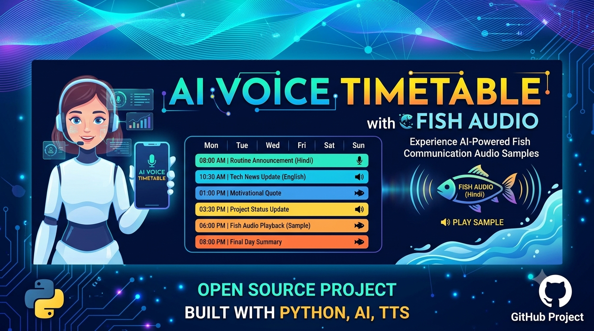

# 🎙️ AI Voice Timetable & Reminder API

- FastAPI, MySQL, aur Fish Audio API par aadharit ek smart backend service jo users ke scheduled timetable tasks ke liye personalized, human-like voice reminders (.mp3) real-time mein generate karti hai.
- A FastAPI and MySQL-based smart backend system that manages user schedules and generates dynamic, personalized voice reminders (.mp3) using Fish Audio API.

---

  

<h1 align="center">TIme_table 🚨</h1>
</p

## 🛠️ Tech Stack & Prerequisites

- **Backend Framework:** FastAPI (Python)
- **Database:** MySQL
- **Database Driver:** mysql-connector-python
- **Voice Generation API:** Fish Audio (Text-to-Speech)
- **Server:**  Uvicorn

---
## 📌 API Endpoints Overview

### 👤 User Operations

* GET / - Check system health and verify backend status.
* POST /users - Onboard a new user into the system.

### 📅 Task & Timetable Operations

* POST /tasks - Schedule a new task for a specific user.
* GET /users/{user_id}/task - Retrieve all scheduled tasks for a specific user.
* GET /task/{task_id}/voice-reminder - Generate and stream a personalized MP3 voice reminder via Fish Audio API.

---
